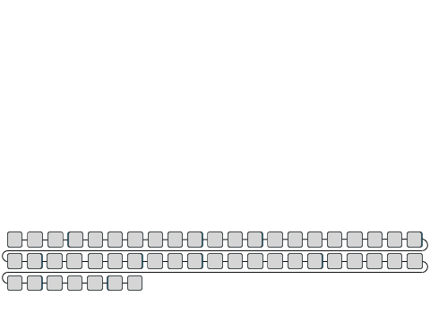

# EvoDiff

### Description
In this work, we introduce a general-purpose diffusion framework, EvoDiff, that combines evolutionary-scale data with 
the distinct conditioning capabilities of diffusion models for controllable protein generation in sequence space. 
EvoDiff generates high-fidelity, diverse, and structurally-plausible proteins that cover natural sequence and functional
space. Critically, EvoDiff can generate proteins inaccessible to structure-based models, such as those with disordered 
regions, while maintaining the ability to design scaffolds for functional structural motifs, demonstrating the 
universality of our sequence-based formulation. We envision that EvoDiff will expand capabilities in protein engineering
beyond the structure-function paradigm toward programmable, sequence-first design.

We evaluate our sequence and MSA models – EvoDiff-Seq and EvoDiff-MSA, respectively – across a range of generation tasks 
to demonstrate their power for controllable protein design. Below, we provide documentation for running our models.

EvoDiff is described in this [preprint](https://www.biorxiv.org/content/10.1101/2023.09.11.556673v1); if you use the code from this repository or the results, please cite the preprint.


<p align="center">

</p>

----

## Table of contents

- [Evodiff](#EvoDiff)
- [Table of contents](#table-of-contents)
- [Installation](#installation)
    - [Datasets](#datasets)
    - [Loading pretrained models](#loading-pretrained-models)
- [Available models](#available-models)
- [Unconditional generation](#unconditional-sequence-generation) 
  - [Unconditional sequence generation](#unconditional-generation-with-evodiff-seq)
  - [Unconditional MSA generation](#unconditional-generation-with-evodiff-msa)
- [Conditional sequence generation](#conditional-sequence-generation)
    - [Evolution-guided protein generation with EvoDiff-MSA](#evolution-guided-protein-generation-with-evodiff-msa)
    - [Generating intrinsically disordered regions](#generating-intrinsically-disordered-regions)
    - [Scaffolding functional motifs](#scaffolding-functional-motifs)
- [Analysis](#analysis-of-generations)
- [Downloading generated sequences](#downloading-generated-sequences)

----

## Installation
To download our code, we recommend creating a clean conda environment with python ```v3.8.5```.
```
conda create --name evodiff python=3.8.5
```
In that new environment, install EvoDiff: 
```
pip install evodiff
pip install git+https://github.com/microsoft/evodiff.git # bleeding edge, current repo main branch
```
You will also need to install PyTorch (we tested our models on ` v2.0.1 `), PyTorch Geometric, and PyTorch Scatter.

We provide a notebook with installation guidance that can be found in [examples/evodiff.ipynb](https://github.com/microsoft/evodiff/tree/main/examples/evodiff.ipynb). It also includes examples on how to generate a smaller number of sequences and MSAs using our models. We recommend following this notebook if you would like to use our models to generate proteins.

Our downstream analysis scripts make use of a variety of tools we do not include in our package installation. To run the
scripts, please download the following packages in addition to EvoDiff:
* [TM score](https://zhanggroup.org/TM-score/)
* [Omegafold](https://github.com/HeliXonProtein/OmegaFold)
* [ProteinMPNN](https://github.com/dauparas/ProteinMPNN)
* [ESM-IF1](https://github.com/facebookresearch/esm/tree/main/esm/inverse_folding); see this [Jupyter notebook](https://colab.research.google.com/github/facebookresearch/esm/blob/main/examples/inverse_folding/notebook.ipynb) for setup details.
* [PGP](https://github.com/hefeda/PGP)
* [DR-BERT](https://github.com/maslov-group/DR-BERT)

We refer to the setup instructions outlined by the authors of those tools.

### Datasets
We obtain sequences from the [Uniref50 dataset](https://www.ncbi.nlm.nih.gov/pmc/articles/PMC4375400/), which contains 
approximately 42 million protein sequences. 
The Multiple Sequence Alignments (MSAs) are from the [OpenFold dataset](https://www.biorxiv.org/content/10.1101/2022.11.20.517210v2), 
which contains 401,381 MSAs for 140,000 unique Protein Data Bank (PDB) chains and 16,000,000 UniClust30 clusters.
The intrinsically disordered regions (IDR) data was obtained from the [Reverse Homology GitHub](https://github.com/alexxijielu/reverse_homology/).

For the scaffolding structural motifs task, we use the baselines compiled in RFDiffusion. We provide pdb and fasta files used for conditionally generating sequences in the [examples/scaffolding-pdbs](https://github.com/microsoft/evodiff/tree/main/examples/scaffolding-pdbs) folder. We also provide pdb files used for conditionally generating MSAs in the [examples/scaffolding-msas](https://github.com/microsoft/evodiff/tree/main/examples/scaffolding-msas) folder.

To access the UniRef50 test sequences, use the following code:
```
test_data = UniRefDataset('data/uniref50/', 'rtest', structure=False) # To access the test sequences
```

The filenames for train and validation Openfold splits are saved in `data/valid_msas.csv` and `data/train_msas.csv`

### Loading pretrained models
To load a model:
```
from evodiff.pretrained import OA_DM_38M

model, collater, tokenizer, scheme = OA_DM_38M()
```
Available evodiff models are:
* ``` D3PM_BLOSUM_640M() ```
* ``` D3PM_BLOSUM_38M() ```
* ``` D3PM_UNIFORM_640M() ```
* ``` D3PM_UNIFORM_38M() ```
* ``` OA_DM_640M() ```
* ``` OA_DM_38M() ```
* ``` MSA_D3PM_BLOSUM_RANDSUB() ```
* ``` MSA_D3PM_BLOSUM_MAXSUB() ```
* ``` MSA_D3PM_UNIFORM_RANDSUB() ```
* ``` MSA_D3PM_UNIFORM_MAXSUB() ```
* ``` MSA_OA_DM_RANDSUB() ```
* ``` MSA_OA_DM_MAXSUB() ```

It is also possible to load our LRAR baseline models: 
* ``` LR_AR_640M() ```
* ``` LR_AR_38M() ```

Note: if you want to download a `BLOSUM` model, you will first need to download [data/blosum62-special-MSA.mat](https://github.com/microsoft/evodiff/blob/main/data/blosum62-special-MSA.mat).

## Available models

We investigated two types of forward processes for diffusion over discrete data modalities to determine which would be most effective. 
In order-agnostic autoregressive diffusion [OADM](https://arxiv.org/abs/2110.02037), one amino acid is converted to a special mask token at each step in the forward process. 
After $T=L$ steps, where $L$ is the length of the sequence, the entire sequence is masked. 
We additionally designed discrete denoising diffusion probabilistic models [D3PM](https://arxiv.org/abs/2107.03006) for protein sequences.
In EvoDiff-D3PM, the forward process corrupts sequences by sampling mutations according to a transition matrix, such that after $T$ steps the sequence is indistinguishable from a uniform sample over the amino acids.
In the reverse process for both, a neural network model is trained to undo the previous corruption. 
The trained model can then generate new sequences starting from sequences of masked tokens or of uniformly-sampled amino acids for EvoDiff-OADM or EvoDiff-D3PM, respectively. 
We trained all EvoDiff sequence models on 42M sequences from UniRef50 using a dilated convolutional neural network architecture introduced in the [CARP](https://doi.org/10.1101/2022.05.19.492714) protein masked language model.
We trained 38M-parameter and 640M-parameter versions for each forward corruption scheme and for left-to-right autoregressive (LRAR) decoding. 

To explicitly leverage evolutionary information, we designed and trained EvoDiff MSA models using the [MSA Transformer](https://proceedings.mlr.press/v139/rao21a.html) architecture on the [OpenFold](https://github.com/aqlaboratory/openfold) dataset}. 
To do so, we subsampled MSAs to a length of 512 residues per sequence and a depth of 64 sequences, either by randomly sampling the sequences ("Random") or by greedily maximizing for sequence diversity ("Max"). Within each subsampling strategy, we then trained EvoDiff MSA models with the OADM and D3PM corruption schemes. 

## Unconditional sequence generation

### Unconditional generation with EvoDiff-Seq

EvoDiff can generate new sequences starting from sequences of masked tokens or of uniformly-sampled amino acids. All available models 
can be used to unconditionally generate new sequences, without needing to download the training datasets. 

To unconditionally generate 100 sequences from EvoDiff-Seq, run the following script:

``` 
python evodiff/generate.py --model-type oa_dm_38M --num-seqs 100 
```

The default model type is `oa_dm_640M`, other evodiff models available are:
* ` oa_dm_38M `
* ` d3pm_blosum_38M `
* ` d3pm_blosum_640M `
* ` d3pm_uniform_38M `
* ` d3pm_uniform_640M `

Our LRAR baseline models are also available:
* ` lr_ar_38M `
* ` lr_ar_640M `


An example of unconditionally generating a sequence of a specified length can be found in
[this notebook](https://github.com/microsoft/evodiff/tree/main/examples/evodiff.ipynb).

To evaluate the generated sequences, we implement our self-consistency Omegafold ESM-IF pipeline, as shown in
[analysis/self_consistency_analysis.py](https://github.com/microsoft/evodiff/blob/main/analysis/self_consistency_analysis.py). 
To use this evaluation script, you must have the dependencies listed under the [Installation](#installation) section installed.

### Unconditional generation with EvoDiff-MSA

To explicitly leverage evolutionary information, we design and train EvoDiff-MSA models using the MSA Transformer architecture 
on the OpenFold dataset. To do so, we subsample MSAs to a length of 512 residues per sequence and a depth of 64 sequences, 
either by randomly sampling the sequences (“Random”) or by greedily maximizing for sequence diversity (“Max”). 

It is possible to unconditionally generate an entire MSA, using the following script:
``` 
python evodiff/generate-msa.py --model-type msa_oa_dm_maxsub --batch-size 1 --n-sequences 64 --n-sequences 256 --subsampling MaxHamming
```

The default model type is `msa_oa_dm_maxsub`, which is EvoDiff-MSA-OADM trained on Max subsampled sequences, and the other available 
evodiff models are: 
* EvoDiff-MSA OADM trained on random subsampled sequences: ` msa_oa_dm_randsub `
* EvoDiff-MSA D3PM-BLOSUM trained on Max subsampled sequences:` msa_d3pm_blosum_maxsub `
* EvoDiff-MSA D3PM-BLOSUM trained on random subsampled sequences: ` msa_d3pm_blosum_randsub `
* EvoDiff-MSA D3PM-Uniform trained on Max subsampled sequences: ` msa_d3pm_uniform_maxsub `
* EvoDiff-MSA D3PM-Uniform trained on random subsampled sequences: ` msa_d3pm_uniform_randsub `

You can also specify a desired number of sequences per MSA, sequence length, batch size, and more.

## Conditional sequence generation
EvoDiff’s OADM diffusion framework induces a natural method for conditional sequence generation by fixing some subsequences and 
predicting the remainder. Because the model is trained to generate proteins with an arbitrary decoding order, this is easily 
accomplished by simply masking and decoding the desired portions. We apply EvoDiff’s power for controllable protein design 
across three scenarios: conditioning on evolutionary information encoded in MSAs, inpainting functional domains, and scaffolding
structural motifs.

### Evolution-guided protein generation with EvoDiff-MSA
First, we test the ability of EvoDiff-MSA (`msa_oa_dm_maxsub`) to generate new query sequences conditioned on the remainder of an MSA, 
thus generating new members of a protein family without needing to train family-specific generative models.

To generate a new query sequence, given an alignment, use the following with the `--start-msa` flag. This starts conditional 
generation by sampling from a validation MSA. To run this script you must have the Openfold dataset and splits downloaded.   
``` 
python evodiff/generate-msa.py --model-type msa_oa_dm_maxsub --batch-size 1 --n-sequences 64 --n-sequences 256 --subsampling MaxHamming --start-msa
```
If you want to generate on a custom MSA, it is possible to retrofit existing code. 

Additionally, the code is capable of generating an alignment given a query sequence, use the following `--start-query` flag. 
This starts with the query and generates the alignment. 
```
python evodiff/generate-msa.py --model-type msa_oa_dm_maxsub --batch-size 1 --n-sequences 64 --n-sequences 256 --subsampling MaxHamming --start-query
 ```
NOTE: you can only specify one of the above flags at a time. You cannot specify both (`--start-query` & `--start-msa`) together. 
Please look at `generate.py` for more information.

### Generating intrinsically disordered regions

Because EvoDiff generates directly in sequence space, we hypothesized that it could natively generate intrinsically disordered regions 
(IDRs). IDRs are regions within a protein sequence that lack secondary or tertiary structure, and they carry out important and diverse
functional roles in the cell directly facilitated by their lack of structure. Despite their prevalence and critical roles in function
and disease, IDRs do not fit neatly in the structure-function paradigm and remain outside the capabilities of structure-based protein
design methods. 

We used inpainting with EvoDiff-Seq and EvoDiff-MSA to intentionally generate disordered regions conditioned on their surrounding
structured regions, and then used DR-BERT to predict disorder scores for each residue in the generated and natural sequences. Note: to
generate with our scripts here, you must have the IDR dataset downloaded. Different pre-processing steps may apply to other datasets. 

To run our code and generate IDRs from EvoDiff-Seq, run the following: 
```
python evodiff/conditional_generation_msa.py --model-type msa_oa_ar_maxsub --cond-task idr --num-seqs 1 
```
or equivalently, from EvoDiff-MSA: 
```
python evodiff/conditional_generation_msa.py --model-type msa_oa_ar_maxsub --cond-task idr --query-only --max-seq-len 150 --num-seqs 1 
```

Which will sample IDRs from the IDR dataset, and generate new ones.

### Scaffolding functional motifs

Given that the fixed functional motif includes the residue identities for the motif, we show that a sequence-only model 
can be used for a motif scaffolding task. We used EvoDiff to generate scaffolds for a set of 17 motif-scaffolding problems 
by fixing the functional motif, supplying only the motif's amino-acid sequence as conditioning information, and then decoding 
the remainder of the sequence.

For the scaffolding structural motifs task, we provide pdb and fasta files used for conditionally generating sequences in the [examples/scaffolding-pdbs](https://github.com/microsoft/evodiff/tree/main/examples/scaffolding-pdbs) folder. We also provide a3m files used for conditionally generating MSAs in the [examples/scaffolding-msas](https://github.com/microsoft/evodiff/tree/main/examples/scaffolding-msas) folder. Please view the PDB codes available and select an appropriate code. In this example, we use PDB code 1prw with domains 16-35 (FSLFDKDGDGTITTKELGTV) and 52-71 (INEVDADGNGTIDFPEFLTM).
An example of generating 1 MSA scaffold of a structural motif can be found in [this notebook](https://github.com/microsoft/evodiff/tree/main/examples/evodiff.ipynb).

To generate from EvoDiff-Seq:
```
python evodiff/conditional_generation.py --model-type oa_dm_640M --cond-task scaffold --pdb 1prw --start-idxs 15 --end-idxs 34 --start-idxs 51 --end-idxs 70 --num-seqs 100 --scaffold-min 50 --scaffold-max 100
```

The `--start-idxs` and `--end-idxs` indicate the start & end indices for the motif being scaffolded. If defining multiple motifs, you can supply the start and end index motifs as new arguments, such as in the example we provide above.

Equivalent code for generating a new scaffold sequence from an EvoDiff-MSA:
```
python evodiff/conditional_generation_msa.py --model-type msa_oa_dm_maxsub --cond-task scaffold --pdb 1prw --start-idxs 15 --end-idxs 34 --start-idxs 51 --end-idxs 70 --num-seqs 1 --query-only
```

To generate a custom scaffold for a given motif, one simply needs to supply the PDB ID, and the residue indices of the motif. The code will download the PDB for you.
In some cases PDB files downloaded from [RCSB](https://www.rcsb.org/) will be incomplete, or contain additional residues. We have implemented code to circumvent PDB-reading issues, but we recommend care when
generating files for this task. 

## Analysis of generations

To analyze the quality of the generations, we look at:
* amino acid KL divergence ([aa_reconstruction_parity_plot](https://github.com/microsoft/evodiff/blob/main/evodiff/plot.py))
* secondary structure KL divergence ([evodiff/analysis/calc_kl_ss.py](https://github.com/microsoft/evodiff/blob/main/analysis/calc_kl_ss.py))
* model perplexity for sequences ([evodiff/analysis/sequence_perp.py](https://github.com/microsoft/evodiff/blob/main/analysis/sequence_perp.py))
* model perplexity for MSAs ([evodiff/analysis/msa_perp.py](https://github.com/microsoft/evodiff/blob/main/analysis/msa_perp.py))
* Fréchet inception distance ([evodiff/analysis/calc_fid.py](https://github.com/microsoft/evodiff/blob/main/analysis/calc_fid.py))
* Hamming distance ([evodiff/analysis/calc_nearestseq_hamming.py](https://github.com/microsoft/evodiff/blob/main/analysis/calc_nearestseq_hamming.py))
* RMSD score ([analysis/rmsd_analysis.py](https://github.com/microsoft/evodiff/blob/main/analysis/rmsd_analysis.py))

We also compute the self-consistency perplexity to evaluate the foldability of generated sequences. To do so, we make use of various tools:
* [TM score](https://zhanggroup.org/TM-score/)
* [Omegafold](https://github.com/HeliXonProtein/OmegaFold)
* [ProteinMPNN](https://github.com/dauparas/ProteinMPNN)
* [ESM-IF1](https://github.com/facebookresearch/esm/tree/main/esm/inverse_folding); see this [Jupyter notebook](https://colab.research.google.com/github/facebookresearch/esm/blob/main/examples/inverse_folding/notebook.ipynb) for setup details.
* [PGP](https://github.com/hefeda/PGP)
* [DR-BERT](https://github.com/maslov-group/DR-BERT)

We refer to the setup instructions outlined by the authors of those tools.

Our analysis scripts for iterating over these tools are in the [evodiff/analysis/downstream_bash_scripts](https://github.com/microsoft/evodiff/tree/main/analysis/downstream_bash_scripts) folder. Once we run the scripts in this folder, we analyze the results in [self_consistency_analysis.py](https://github.com/microsoft/evodiff/blob/main/analysis/self_consistency_analysis.py).

## Downloading generated sequences

We provide all generated sequences on the [EvoDiff Zenodo](https://zenodo.org/record/8332830).

To download our unconditional generated sequences from `unconditional_generations.csv` file:

```
curl -O https://zenodo.org/record/8332830/files/unconditional_generations.csv?download=1
```

To extract all unconditionally generated sequences created using the EvoDiff-seq `oa_dm_640M` model, run the following code:
```
import pandas as pd
df = pd.read_csv('unconditional_generations.csv', index_col = 0)
subset = df.loc[df['model'] == 'evodiff_oa_dm_640M']
```

The CSV files containing generated data are organized as follows:
* Unconditional generations from sequence-based models: ` unconditional_generations.csv`
  * `sequence`: generated sequence
  * `min hamming dist`: minimum Hamming distance between generated sequence and all training sequences
  * `seq len`: length of generated sequence
  * `model`: model type used for generations, models: `evodiff_oa_dm_38M`, `evodiff_oa_dm_640M`, `evodiff_d3pm_uniform_38M`, \
  `evodiff_d3pm_uniform_640M`, `evodiff_d3pm_blosum_38M`, `evodiff_d3pm_blosum_640M`, `carp_38M`, `carp_640M`, `lr_ar_38M` \
  `lr_ar_38M`, `lr_ar_640M`, `esm_1b`, or `esm_2`
* Sequence predictions for unconditional structure generation baselines: ` esmif_predictions_unconditional_structure_generations.csv`
  * `sequence`: predicted protein sequence from protein structure (using ESM-IF1 model)
  * `seq len`: length of generated sequence
  * `model`: 'foldingdiff' or 'rfdiffusion'
* Sequence generation via evolutionary alignments: ` msa_evolution_conditional_generations.csv`
  * `sequence`: generated query sequences
  * `seq len`: length of generated sequence
  * `model`: model type used for generations: `evodiff_msa_oa_dm_maxsub`, `evodiff_msa_oa_dm_randsub`, `esm_msa_1b`, or `potts`
* Generated IDRs: ` idr_conditional_generations.csv`
  * `sequence`: subsampled sequence that contains IDR
  * `seq len`: length of generated sequence
  * `gen_idrs`: the generated IDR sequence
  * `original_idrs`: the original IDR sequence
  * `start_idxs`: indices corresponding to start of IDR in sequence
  * `end_idxs`: indices corresponding to end of IDR in sequence (inclusive)
  * `model`: model type used for generations `evodiff_seq_oa_dm_640M` or `evodiff_msa_oa_dm_maxsub`
* Successfully generated scaffolds ` msa_scaffold.csv` (EvoDiff-MSA generations) or `seq_scaffold.csv` (Evodiff-Seq generations) 
  * `pdb`: pdb code corresponding to scaffold task
  * `seqs`: generated scaffold and motif
  * `start_idxs`: indices corresponding to start of motif
  * `end_idxs`: indices corresponding to end of motif
  * `seq len`: length of generated sequence
  * `scores`: average predicted local distance difference test (pLDDT) of sequence
  * `rmsd`: motifRMSD between predicted motif coordinates and crystal motif coordinates
  * `model`: model type used for generations

## Contributing

This project welcomes contributions and suggestions.  Most contributions require you to agree to a
Contributor License Agreement (CLA) declaring that you have the right to, and actually do, grant us
the rights to use your contribution. For details, visit https://cla.opensource.microsoft.com.

When you submit a pull request, a CLA bot will automatically determine whether you need to provide
a CLA and decorate the PR appropriately (e.g., status check, comment). Simply follow the instructions
provided by the bot. You will only need to do this once across all repos using our CLA.

This project has adopted the [Microsoft Open Source Code of Conduct](https://opensource.microsoft.com/codeofconduct/).
For more information see the [Code of Conduct FAQ](https://opensource.microsoft.com/codeofconduct/faq/) or
contact [opencode@microsoft.com](mailto:opencode@microsoft.com) with any additional questions or comments.

## Trademarks

This project may contain trademarks or logos for projects, products, or services. Authorized use of Microsoft 
trademarks or logos are subject to and must follow 
[Microsoft's Trademark & Brand Guidelines](https://www.microsoft.com/en-us/legal/intellectualproperty/trademarks/usage/general).
Use of Microsoft trademarks or logos in modified versions of this project must not cause confusion or imply Microsoft sponsorship.
Any use of third party trademarks or logos is subject to those third-party's policies.
